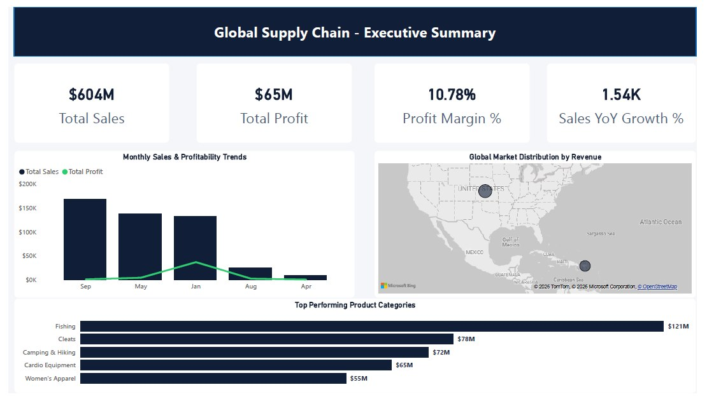
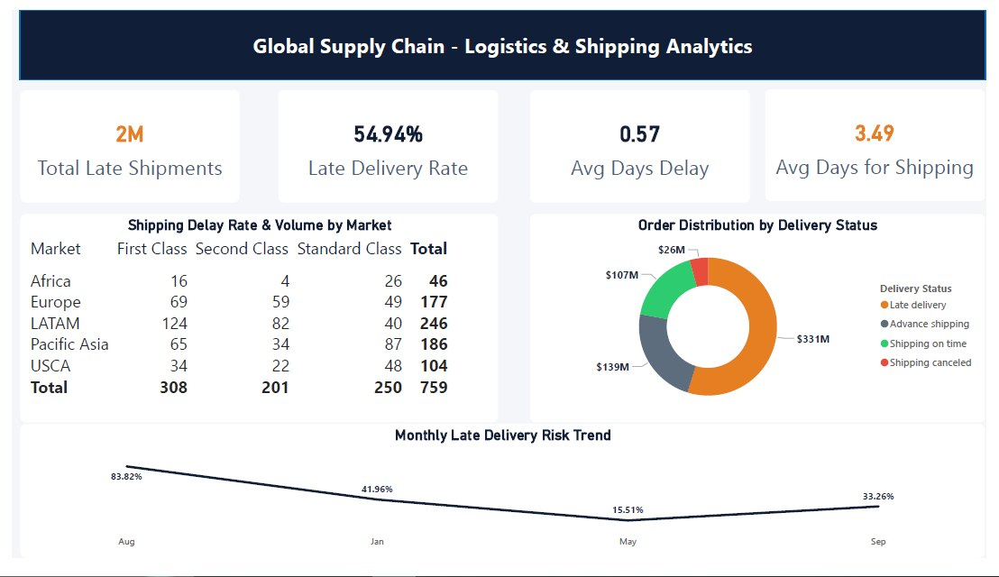
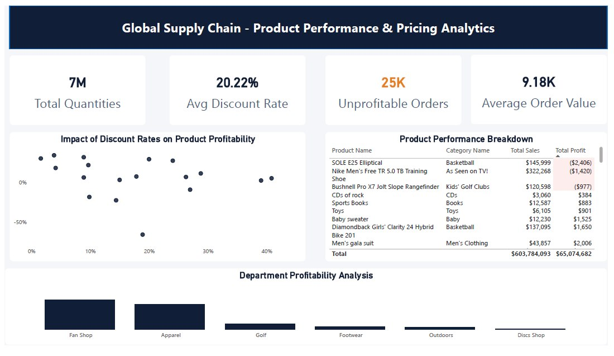
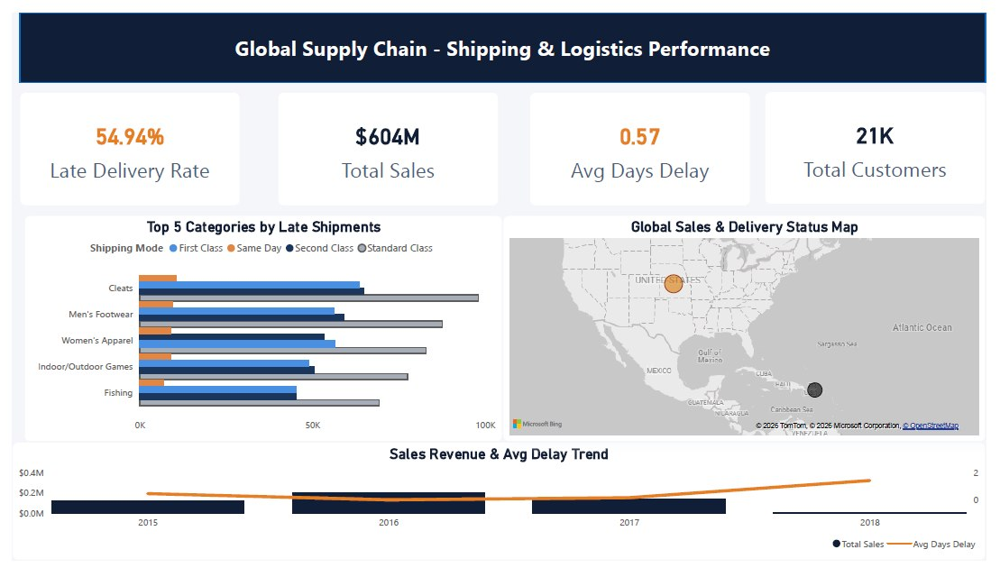

# Global Supply Chain - Shipping & Logistics Analytics Dashboard

An interactive end-to-end Power BI dashboard analyzing global logistics operations, product performance, and shipping efficiency using the DataCo Supply Chain dataset.

## 🚀 Key Features & Insights
* **Executive Summary:** High-level overview of total sales ($604M), profit margins (10.78%), and key performance indicators (KPIs) like Sales YoY Growth.
* **Shipping & Logistics Analytics:** Dynamic visual representation of late delivery rates (54.94%), average days of delay (0.57), and product-specific shipping modes.
* **Geographical Sales Distribution:** Interactive mapping of global sales volume coupled with automated delay alerts using conditional color scales.
* **Product Performance & Pricing:** Detailed breakdown of product profitability, discount rate impacts, and identifying unprofitable orders to optimize operations.

## 🛠️ Tech Stack & Skills
* **Power BI Desktop:** Advanced data modeling, relationship management, and visualization design.
* **DAX (Data Analysis Expressions):** Created robust custom measures for tracking late delivery rates, average shipping delays, and YoY sales growth.
* **Data Storytelling:** Customized visual layouts and strict color hierarchy (Navy for financial stability, Amber/Orange for logistical warnings) to optimize executive decision-making.

---

## 📸 Dashboard Previews (Pages 1 to 4)

Below are the key pages of the interactive dashboard:

### Page 1: Executive Summary
*Provides a comprehensive high-level performance overview of the entire global supply chain.*

### Page 2: Logistics & Shipping Analytics
*In-depth analytics focused on delivery status distribution, delay rates, and shipping risk trends.*

### Page 3: Product Performance & Pricing Analytics
*Analyzes profitability breakdowns by product name, department, and the direct impact of discounts.*

### Page 4: Global Supply Chain - Shipping & Logistics Performance (AI & Operations)
*Our custom operational view tracking top categories by late shipments with a global Sales & Delivery Status Map.*

---

## 📂 Project Structure & Dataset Source
To view the project files locally:
1. Clone this repository.
2. The Power BI report file (`.pbix`) can be found in the `Dashboards/` directory.
3. The analysis is based on the **DataCo Supply Chain Dataset**. Due to file size limitations, you can access the original dataset [Here - Link to Kaggle/Source].
