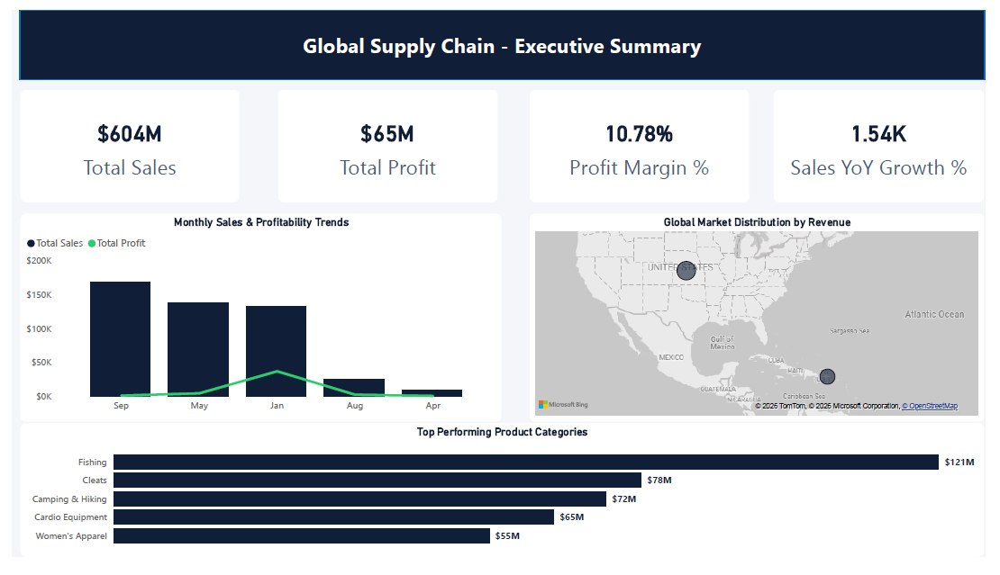
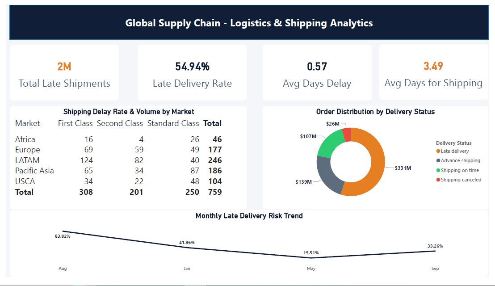
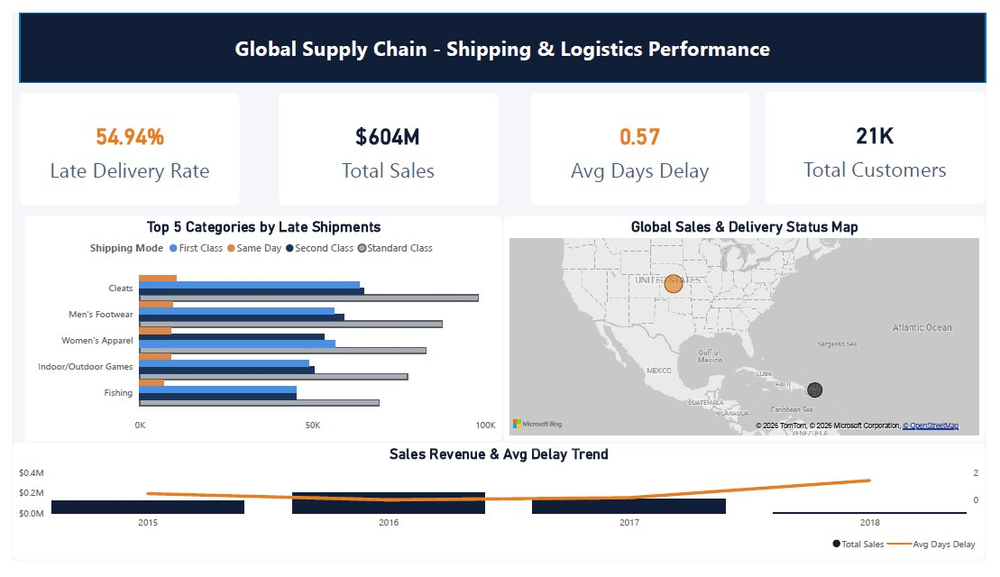
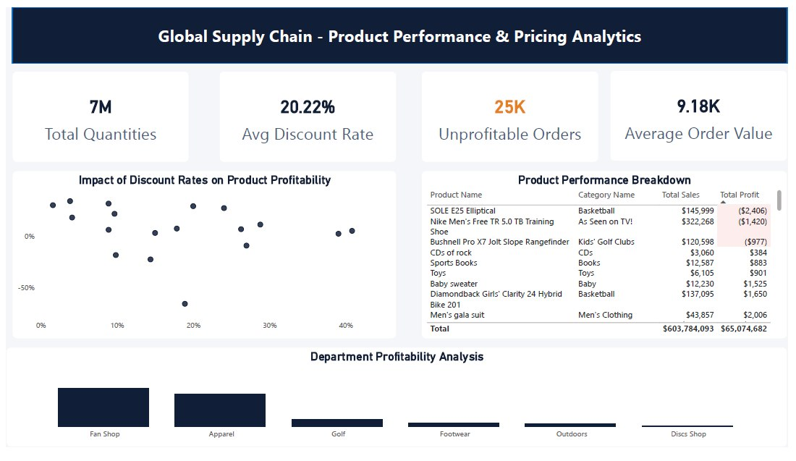

# Global Supply Chain – Shipping & Logistics Analytics Dashboard 🌎📦

📌 **Project Overview**  
An end-to-end Power BI Supply Chain & Logistics Analytics project built using the DataCo Supply Chain dataset. The objective was to go beyond reporting sales and shipping KPIs and answer a critical business question:

> **Is strong revenue growth being supported by an efficient and reliable supply chain?**

By connecting sales, profitability, shipping performance, product behavior, pricing, and geography, the dashboard identifies operational risks that could directly affect customer experience and business profitability.

---

## 🖼️ Executive Dashboard Preview

<p align="center">
  
</p>

---

## 📊 Executive Performance

The analyzed business demonstrates strong financial growth alongside a critical operational gap:

| Financial Metric | Performance | Operational Metric | Performance |
| :--- | :--- | :--- | :--- |
| **💰 Total Sales** | **$604M** | **🚚 Late Delivery Rate** | **54.94%** ⚠️ |
| **📈 Profit Margin** | **10.78%** | **⏱️ Avg Days Delayed** | **0.57 Days** |

> ⚠️ **Key Risk:** More than half of all shipments are classified as **Late**. Financial performance is strong, but logistics reliability poses a long-term customer retention and operational cost risk.

---

## 🔎 Key Business Insights

### 1️⃣ Strong Sales — But Significant Delivery Risk
A **54.94% late delivery rate** creates a clear divergence between commercial growth and operational execution. Consistently late deliveries can result in:
* Increased customer churn & negative reviews
* Elevated operational and logistics support costs
* Potential order cancellations and returns

<p align="center">
  
</p>

💡 **Business Opportunity:**  
Trace bottlenecks granularly: `Region` ➔ `Shipping Mode` ➔ `Product Category` ➔ `Department` ➔ `Delivery Status`.

---

### 🌎 2️⃣ Geography & Shipping Mode Optimization
Cross-analyzing geography and fulfillment modes reveals localized supply chain bottlenecks:

<p align="center">
  
</p>

* **Prioritize High-Value Markets:** Focus logistics infrastructure improvements on regions combining **High Sales Volume + High Delay Rates**.
* **Carrier Strategy:** Re-evaluate shipping modes based on delay rate and average delay metrics alongside cost.

---

### 💰 3️⃣ Product Pricing & Unprofitable Discounting
Analyzing discount rates against final profit margins helps uncover orders that drive sales volume at the expense of profitability:

<p align="center">
  
</p>

💡 **Business Opportunity:**  
Evaluate promotions via: `Discount Rate` ➔ `Sales Volume` ➔ `Profit Margin` ➔ `Net Profitability`. Identify and adjust promos that generate gross revenue while destroying net margin.

---

## 📊 Dashboard Structure

| Page | View | Primary Objective |
| :--- | :--- | :--- |
| **Page 1** | **Executive Summary** | Global revenue, profit margins, sales YoY growth, and core supply chain KPIs. |
| **Page 2** | **Logistics & Shipping** | Delivery status breakdown, late delivery rates, and carrier/shipping mode performance. |
| **Page 3** | **Product & Pricing** | Category profitability, discount impact analysis, and negative-margin order tracking. |
| **Page 4** | **Global Performance** | Geographical sales heatmap, regional delivery risks, and localized logistics monitoring. |

---

## 🎯 Strategic Action Plan

1. **🚚 Reduce Late Deliveries:** Isolate and re-route specific carrier/region combinations exhibiting delay spikes.
2. **🌎 Regional Prioritization:** Target high-revenue markets suffering from low delivery compliance.
3. **📦 Shipping Strategy Realignment:** Select carriers based on on-time SLA metrics over volume-only discounts.
4. **💰 Protect Margins:** Audit promotional discounts that yield negative net profitability.

---

## 🛠️ Technical Implementation

* **Power BI & Visual Hierarchy:** Multi-page interactive layout structured from high-level financial KPIs down to operational root causes.
* **DAX Analytics:** Developed dynamic DAX measures for:
  ```dax
  Late_Delivery_Rate = 
  DIVIDE([Late_Orders], [Total_Orders], 0)
